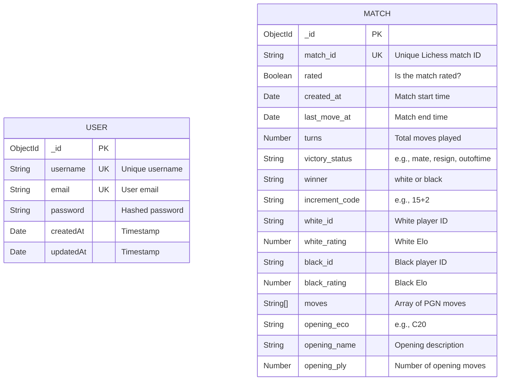

<div align="center">
  

  <h1>♟️ Grandmaster Analytics</h1>

  <p><strong>An Enterprise-Grade Full-Stack Platform for Deep Chess Match Analysis</strong></p>

  [](https://chess-game-dataset-harshit-kumar.vercel.app)
  [](https://chess-game-dataset-harshit-kumar.onrender.com)
  [](https://documenter.getpostman.com/view/50839854/2sBXwtqpxw)
  [](LICENSE)

  <br />

  ### 🔗 Live Links
  🌐 **Frontend Live Demo:** [chess-game-dataset-harshit-kumar.vercel.app](https://chess-game-dataset-harshit-kumar.vercel.app)  
  ⚙️ **Backend API URL:** [chess-game-dataset-harshit-kumar.onrender.com](https://chess-game-dataset-harshit-kumar.onrender.com)  
  📚 **Postman Documentation:** [Postman API Reference](https://documenter.getpostman.com/view/50839854/2sBXwtqpxw)

</div>

---

## 🌟 Introduction

**Grandmaster Analytics** is a modern, beautifully designed full-stack web application built to analyze massive datasets of professional chess matches. 

Whether you want to discover the highest win-rate openings, analyze player trends, or filter millions of matches by Elo, time control, or victory status, Grandmaster Analytics provides the tools to do it. It features a lightning-fast Node.js/Express REST API on the backend and a stunning, glassmorphism-inspired React Dashboard on the frontend.

---

## 🌊 Project Flow & Architecture

The project is built on a **MERN-stack** architecture (MongoDB, Express, React, Node.js), cleanly separated into two environments:

```text
+-------------------------+         REST API         +-------------------------+
|                         |    (JSON over HTTP)      |                         |
|  💻 React Dashboard     | -----------------------> |  ⚙️ Node.js / Express   |
|   (Vite + Redux)        | <----------------------- |   (Controllers + JWT)   |
|                         |                          |                         |
+-----------+-------------+                          +------------+------------+
            |                                                     |
            |                                                     |
            |                                           Mongoose ODM (Queries)
            |                                                     |
            |                                                     V
            |                                        +-------------------------+
            |                                        |                         |
            +----------- View Updates -------------- |  🗄️ MongoDB Database    |
                                                     |   (Aggregations)        |
                                                     |                         |
                                                     +-------------------------+
```

1. **The Client (React + Vite):** 
   - A highly responsive dashboard where users can log in, view live charts, browse paginated chess matches, and configure settings. 
   - Uses **Redux Toolkit** for robust global state management (Authentication & UI Theming).
   - Secures private routes to ensure only logged-in users can view sensitive data.

2. **The Server (Node + Express):**
   - Receives API requests and verifies user identity using **JWT (JSON Web Tokens)**.
   - Queries a highly-optimized **MongoDB** database to perform complex aggregations (e.g., finding the most successful openings, or filtering matches by Elo ratings).
   - Returns paginated JSON data back to the frontend to ensure fast loading times.

---

## 🗄️ Database Schema (ERD)

Below is the Entity-Relationship Diagram representing the core MongoDB collections used in Grandmaster Analytics. The dataset separates application users from the historical chess match data.



---

## 🛠️ Tech Stack & Technologies

### 💻 Frontend Architecture


### ⚙️ Backend Architecture


---

## ✨ Key Features

- **🔐 Secure Authentication:** Complete JWT-based registration, login, and protected routing.
- **📊 Interactive Dashboard:** High-level metrics showing total games, active players, and unique openings.
- **🔍 Deep Filtering:** Find games based on time controls (Bullet, Blitz, Rapid, Classical), Victory Status (Checkmate, Resignation, Time Out), and Elo thresholds.
- **🌓 Dual Theming:** Beautiful Light and Dark modes with a sleek glassmorphism aesthetic (persisted via LocalStorage).
- **📱 Fully Responsive:** Works perfectly on desktop, tablet, and mobile devices with a sliding hamburger menu and Framer Motion animations.

---

## 📡 Core API Endpoints

The backend exposes a highly optimized REST API. All protected routes require a `Bearer <token>` in the Authorization header.

| Method | Endpoint | Description | Auth Required |
|--------|----------|-------------|---------------|
| `POST` | `/api/v1/auth/register` | Register a new user | ❌ |
| `POST` | `/api/v1/auth/login` | Login and receive JWT | ❌ |
| `GET`  | `/api/v1/auth/profile` | Get current user profile | ✅ |
| `GET`  | `/api/v1/matches` | Fetch paginated chess matches | ✅ |
| `GET`  | `/api/v1/matches/:id` | Get details of a single match | ✅ |
| `GET`  | `/api/v1/players` | Fetch top players & stats | ✅ |
| `GET`  | `/api/v1/openings` | Aggregate most successful openings | ✅ |
| `GET`  | `/api/v1/system/health` | API Healthcheck status | ❌ |

---

## 📁 Directory Structure

```text
chess_game_dataset_harshit_kumar/
├── backend/                  # Express.js REST API
│   ├── data/                 # Raw dataset CSV/JSON files
│   ├── src/
│   │   ├── controllers/      # Route request handlers
│   │   ├── middlewares/      # JWT validation, error handling
│   │   ├── models/           # Mongoose schemas
│   │   └── routes/           # API route definitions
│   └── package.json
└── frontend/                 # React (Vite) Single Page App
    ├── public/               # Static assets
    ├── src/
    │   ├── components/       # Reusable UI components (Sidebar, Navbar, etc.)
    │   ├── pages/            # View components (Dashboard, Login, Settings)
    │   ├── services/         # Axios API configuration
    │   └── store/            # Redux ToolKit global state slices
    ├── vercel.json           # Vercel SPA routing rules
    └── package.json
```

---

## 🚀 Local Installation

Want to run Grandmaster Analytics on your own machine? Follow these easy steps:

### 1. Clone the Repository
```bash
git clone https://github.com/harshit-kumar-dev/chess_game_dataset_harshit_kumar.git
cd chess_game_dataset_harshit_kumar
```

### 2. Setup the Backend
```bash
cd backend
npm install
```
Create a `.env` file inside the `backend` folder:
```env
PORT=5000
MONGODB_URI=your_mongodb_connection_string
JWT_SECRET=your_super_secret_key
```
Run the backend server:
```bash
npm run dev
```

### 3. Setup the Frontend
Open a new terminal window:
```bash
cd frontend
npm install
```
Create a `.env` file inside the `frontend` folder:
```env
VITE_API_URL=http://localhost:5000/api/v1
```
Run the frontend server:
```bash
npm run dev
```

### 4. Play!
Open your browser and navigate to `http://localhost:5173` to view the app!

---
<div align="center">
  <p>Built with ❤️ by <strong>Harshit Kumar</strong></p>
</div>